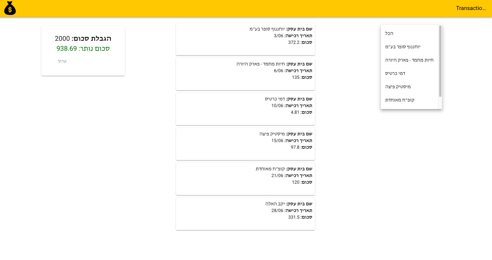

# Welcome to RiseUp

In our company we often deal with people’s bank account info and credit card statements.
The credit card data comes in many different formats and one simple operation we do is to parse the data so we can convert it into a common format.

Before we begin the exercise, make sure you can run the project

### Setup
```
# Run the client
npm install
npm start
```


The exercise has several steps:

# 1 - Parse Html File

We define a *transaction* to be an object with the following keys:

	transactionDate
	businessName
	transactionAmount

### Objective

implement the function "parseTransaction" inside 'parser/transactionsParser.vue' that reads the file "public/html-file/transactions.html" and returns a list of transactions.

### General Guidelines:
- Use the [package cheerio](https://github.com/cheeriojs/cheerio) to parse html data
- Focus on *execution* - making code that works is top priority
- After the code works you can prettify/refactor it
- Ignore the summary line in each statement

### Example

`/path/to/transactions.html:`

| תאריך רכישה | שם בית עסק | סכום עסקה |
| --- | --- | --- |
| 04/12 |סופרמרקט | 199.99 |
| 21/12 |סינמה סיטי | 84.00 |
| | סך חיוב בשח: | 283.99 |

`parseHTML('/path/to/transactions.html')` should return:

	[
	  {
	    transactionDate: '04/12',
	    businessName: 'סופרמרקט',
	    transactionAmount: 199.99
	  },
	  {
	    transactionDate: '21/12',
	    businessName: 'סינמה סיטי',
	    transactionAmount: 84.00
	  },
	]

# 2 - Present the transactions on screen

Implement `TransactionsList.vue` so it would look like this:


**Guidelines:**
* You can start with the TransactionsList.vue component in src/components
* If you add any component, add it in the same directory

# 3 - Add "Expense Limit" Section

Allow the user to set expense limit, the default value will be 2000 NIS.
The app will calculate the total expense sum, and will present the remaining amount.
If the remaining amount is negative, the amount color will be green, If the remaining amount is negative, the amount color will be changed to red.

Examples:


# 4 (Bonus) - Filter the presented transactions by businessName

Add an option to filter the presented transaction by choosing a business name from
the existing business names

For example:





